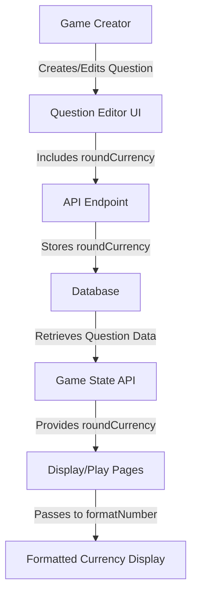

# Design Document: Currency Rounding Control

## Overview

This feature adds per-question control over currency rounding in the #Trivia game. Currently, the `formatNumber` function supports a `roundCurrency` option that defaults to true, but this setting cannot be configured per question. This enhancement allows game creators to specify whether currency values should be rounded to whole dollars or display cents for each individual question.

The feature impacts four main areas:

1. Database schema (adding `roundCurrency` field to question tables)
2. Question editing UI (adding checkbox controls)
3. Display logic (passing the setting to formatNumber)
4. Data migration (ensuring backward compatibility)

The implementation maintains backward compatibility by defaulting to true (rounded) for existing questions and new questions where the setting is not explicitly specified.

## Architecture

### System Components

The feature touches the following architectural layers:

1. **Data Layer**: Database schema modifications to store the `roundCurrency` preference
2. **API Layer**: Updates to question creation/update endpoints to handle the new field
3. **UI Layer**: Modifications to question editor components to expose the control
4. **Display Layer**: Updates to display and play pages to use the per-question setting

### Data Flow



### Component Interactions

- **QuestionCustomizationEditor**: Displays checkbox when editing pre-made questions with currency format
- **AddQuestionButton**: Displays checkbox when creating new manual questions with currency format
- **QuestionListEditor**: Displays checkbox when editing existing game questions with currency format
- **Display Page**: Retrieves `roundCurrency` from question data and passes to `formatNumber`
- **Play Page**: Retrieves `roundCurrency` from question data and passes to `formatNumber`
- **formatNumber**: Already supports `roundCurrency` option, no changes needed

## Components and Interfaces

### Database Schema Changes

**File**: `lib/db/schema.ts`

Add `roundCurrency` field to both question tables:

```typescript
// In questions table
export const questions = pgTable("questions", {
  // ... existing fields ...
  roundCurrency: integer("round_currency").default(1), // 1 = true, 0 = false, null = default to true
});

// In questionSetQuestions table
export const questionSetQuestions = pgTable("question_set_questions", {
  // ... existing fields ...
  roundCurrency: integer("round_currency").default(1), // 1 = true, 0 = false, null = default to true
});
```

**Design Decision**: Using `integer` type instead of `boolean` because PostgreSQL boolean handling through Drizzle can be inconsistent. Using 1/0/null provides explicit control and allows null for backward compatibility.

### UI Component Changes

#### QuestionCustomizationEditor

**File**: `components/game-creation/QuestionCustomizationEditor.tsx`

Changes needed:

1. Add `roundCurrency` field to the `Question` interface (default: true)
2. Add checkbox input in the edit form that appears when `answerFormat === "currency"`
3. Update form state management to handle the new field
4. Position checkbox below the Answer Format dropdown

#### AddQuestionButton

**File**: `app/host/[gameId]/components/AddQuestionButton.tsx`

Changes needed:

1. Add `roundCurrency` state variable (default: true)
2. Add checkbox input that appears when `answerFormat === "currency"`
3. Include `roundCurrency` in the API request body when creating questions
4. Position checkbox below the Answer Format dropdown

#### QuestionListEditor

**File**: `app/host/[gameId]/components/QuestionListEditor.tsx`

Changes needed:

1. Add `roundCurrency` to edit state
2. Add checkbox input in edit mode when question has currency format
3. Include `roundCurrency` in the PATCH request when updating questions
4. Display current rounding setting in view mode for currency questions

### Display Logic Changes

#### Display Page

**File**: `app/display/[gameId]/page.tsx`

Changes needed:

1. Ensure `roundCurrency` is included in the question data from API
2. Pass `roundCurrency` to `formatNumber` calls for guesses and correct answers
3. Default to `true` if `roundCurrency` is null or undefined

Affected `formatNumber` calls:

- Betting phase: formatting player guesses
- Reveal phase: formatting correct answer
- Reveal phase: formatting player guesses in the grid

#### Play Page

**File**: `app/play/[gameId]/page.tsx`

Changes needed:

1. Ensure `roundCurrency` is included in the question data from API
2. Pass `roundCurrency` to `formatNumber` calls for betting options and reveal
3. Default to `true` if `roundCurrency` is null or undefined

Affected `formatNumber` calls:

- Betting phase: formatting betting options
- Reveal phase: formatting correct answer

### API Changes

The following API endpoints need to handle the new `roundCurrency` field:

1. **POST /api/games/[gameId]/questions**: Accept `roundCurrency` in request body
2. **PATCH /api/games/[gameId]/questions/[questionId]**: Accept `roundCurrency` in request body
3. **GET /api/games/[gameId]/state**: Include `roundCurrency` in question objects

## Data Models

### Question Model (Extended)

```typescript
interface Question {
  id: string;
  gameId: string;
  orderIndex: number;
  text: string;
  subText: string | null;
  correctAnswer: string; // stored as decimal
  answerFormat: "plain" | "currency" | "date" | "percentage";
  followUpNotes: string | null;
  roundCurrency: boolean | null; // NEW: null defaults to true for backward compatibility
}
```

### QuestionSetQuestion Model (Extended)

```typescript
interface QuestionSetQuestion {
  id: string;
  questionSetId: string;
  orderIndex: number;
  text: string;
  subText: string | null;
  correctAnswer: string; // stored as decimal
  answerFormat: "plain" | "currency" | "date" | "percentage";
  followUpNotes: string | null;
  roundCurrency: boolean | null; // NEW: null defaults to true for backward compatibility
}
```

### Database Migration

The migration will:

1. Add `round_currency` column to `questions` table with default value 1
2. Add `round_currency` column to `question_set_questions` table with default value 1
3. Allow null values for backward compatibility
4. Existing rows will have null, which the application treats as true

Migration SQL:

```sql
ALTER TABLE questions ADD COLUMN round_currency INTEGER DEFAULT 1;
ALTER TABLE question_set_questions ADD COLUMN round_currency INTEGER DEFAULT 1;
```

## Correctness Properties

_A property is a characteristic or behavior that should hold true across all valid executions of a system—essentially, a formal statement about what the system should do. Properties serve as the bridge between human-readable specifications and machine-verifiable correctness guarantees._

### Property Reflection

After analyzing the acceptance criteria, I identified the following redundancies:

- Properties 3.3 and 4.3 are identical (both test null roundCurrency defaults to true)
- Properties 2.5 and 2.6 can be combined into a single property about conditional checkbox visibility
- Properties 3.1 and 3.2 can be combined into a single property about passing roundCurrency to formatNumber

The following properties represent the unique, non-redundant correctness requirements:

### Property 1: Default roundCurrency on question creation

_For any_ question created without explicitly specifying a `roundCurrency` value, the database should store true (or 1 in integer representation) as the default value.

**Validates: Requirements 1.3**

### Property 2: Checkbox visibility based on answer format

_For any_ question being edited, the round currency checkbox should be visible if and only if the `answerFormat` is "currency".

**Validates: Requirements 2.5, 2.6**

### Property 3: Default checkbox state for new questions

_For any_ new question being created with currency format, the round currency checkbox should be checked by default.

**Validates: Requirements 2.4**

### Property 4: Checkbox toggle updates question data

_For any_ question editor, when the round currency checkbox is toggled, the question's `roundCurrency` value should be updated to match the checkbox state.

**Validates: Requirements 2.7**

### Property 5: Display components pass roundCurrency to formatNumber

_For any_ currency value being displayed (whether guess or correct answer), the display component should pass the question's `roundCurrency` value to the `formatNumber` function.

**Validates: Requirements 3.1, 3.2**

### Property 6: Null roundCurrency defaults to true

_For any_ question with a null `roundCurrency` value, the display component should pass true to the `formatNumber` function.

**Validates: Requirements 3.3, 4.3**

### Property 7: formatNumber rounds when roundCurrency is true

_For any_ currency value formatted with `roundCurrency=true`, the output string should not contain a decimal point or cents (e.g., "$1,234" not "$1,234.00").

**Validates: Requirements 3.4**

### Property 8: formatNumber shows cents when roundCurrency is false

_For any_ currency value formatted with `roundCurrency=false`, the output string should contain exactly two decimal places for cents (e.g., "$1,234.56").

**Validates: Requirements 3.5**

## Error Handling

### Database Errors

- **Schema Migration Failure**: If the migration fails to add the `roundCurrency` column, the application should log the error and prevent startup until the schema is corrected.
- **Invalid roundCurrency Values**: The database should only accept 0, 1, or null for the `roundCurrency` field. Invalid values should be rejected with a constraint error.

### UI Validation

- **Missing roundCurrency on Save**: If a question with currency format is saved without a `roundCurrency` value, default to true before sending to the API.
- **Type Conversion**: Ensure boolean checkbox state is properly converted to integer (1/0) for database storage.

### Display Errors

- **Missing Question Data**: If `roundCurrency` is undefined (not null, but missing from the object), default to true to maintain backward compatibility.
- **Invalid formatNumber Parameters**: If `formatNumber` receives an invalid `roundCurrency` value (not boolean), default to true and log a warning.

### API Validation

- **Question Creation**: Validate that `roundCurrency` is a boolean or null before storing. Reject requests with invalid types.
- **Question Updates**: Allow partial updates that don't include `roundCurrency` without changing the existing value.

## Testing Strategy

### Unit Testing

Unit tests should focus on specific examples and edge cases:

1. **Schema Tests**:
   - Verify `roundCurrency` field exists in both question tables
   - Verify default value is set to 1
   - Verify null values are allowed

2. **UI Component Tests**:
   - Test checkbox appears for currency format questions
   - Test checkbox hidden for non-currency format questions
   - Test checkbox default state is checked
   - Test checkbox toggle updates component state

3. **formatNumber Tests** (existing function):
   - Test with `roundCurrency=true` produces no cents
   - Test with `roundCurrency=false` produces two decimal places
   - Test with `roundCurrency=undefined` defaults to true

4. **API Tests**:
   - Test creating question with `roundCurrency=true`
   - Test creating question with `roundCurrency=false`
   - Test creating question without `roundCurrency` (defaults to true)
   - Test updating question's `roundCurrency` value

### Property-Based Testing

Property-based tests should verify universal properties across all inputs. Use a property-based testing library appropriate for the stack (e.g., fast-check for TypeScript/JavaScript).

**Configuration**: Each property test should run a minimum of 100 iterations to ensure comprehensive coverage through randomization.

**Test Tagging**: Each property test must include a comment tag referencing the design property:

```typescript
// Feature: currency-rounding-control, Property 1: Default roundCurrency on question creation
```

#### Property Test 1: Default roundCurrency on question creation

Generate random question data without `roundCurrency` field, create the question via API, then verify the stored value is true (or 1).

**Feature: currency-rounding-control, Property 1: Default roundCurrency on question creation**

#### Property Test 2: Checkbox visibility based on answer format

Generate random questions with various answer formats, render the editor component, and verify checkbox visibility matches the format being "currency".

**Feature: currency-rounding-control, Property 2: Checkbox visibility based on answer format**

#### Property Test 3: Default checkbox state for new questions

Generate random new currency questions, render the editor, and verify the checkbox is checked by default.

**Feature: currency-rounding-control, Property 3: Default checkbox state for new questions**

#### Property Test 4: Checkbox toggle updates question data

Generate random question states, simulate checkbox toggle events, and verify the question data updates correctly.

**Feature: currency-rounding-control, Property 4: Checkbox toggle updates question data**

#### Property Test 5: Display components pass roundCurrency to formatNumber

Generate random questions with various `roundCurrency` values, mock the `formatNumber` function, render display components, and verify `formatNumber` is called with the correct `roundCurrency` parameter.

**Feature: currency-rounding-control, Property 5: Display components pass roundCurrency to formatNumber**

#### Property Test 6: Null roundCurrency defaults to true

Generate random questions with `roundCurrency=null`, render display components with mocked `formatNumber`, and verify `formatNumber` receives `true`.

**Feature: currency-rounding-control, Property 6: Null roundCurrency defaults to true**

#### Property Test 7: formatNumber rounds when roundCurrency is true

Generate random currency values, call `formatNumber` with `roundCurrency=true`, and verify the output contains no decimal point.

**Feature: currency-rounding-control, Property 7: formatNumber rounds when roundCurrency is true**

#### Property Test 8: formatNumber shows cents when roundCurrency is false

Generate random currency values, call `formatNumber` with `roundCurrency=false`, and verify the output contains exactly two decimal places.

**Feature: currency-rounding-control, Property 8: formatNumber shows cents when roundCurrency is false**

### Integration Testing

Integration tests should verify the complete flow:

1. **End-to-End Question Creation**:
   - Create a question with `roundCurrency=false` via UI
   - Verify it's stored correctly in database
   - Load the game and verify currency displays with cents

2. **End-to-End Question Editing**:
   - Edit an existing question's `roundCurrency` setting
   - Verify the change persists
   - Verify display updates accordingly

3. **Migration Testing**:
   - Run migration on a test database
   - Verify columns are added
   - Verify existing questions work correctly with null values

### Manual Testing Checklist

- [ ] Create a new game with currency questions
- [ ] Toggle roundCurrency checkbox and verify UI updates
- [ ] Save question and verify setting persists
- [ ] Play the game and verify currency displays correctly (rounded vs. with cents)
- [ ] Edit existing question and change roundCurrency setting
- [ ] Verify backward compatibility with questions created before this feature
- [ ] Test all three question editor components (QuestionCustomizationEditor, AddQuestionButton, QuestionListEditor)
- [ ] Verify checkbox only appears for currency format questions
- [ ] Test on both display and play pages
