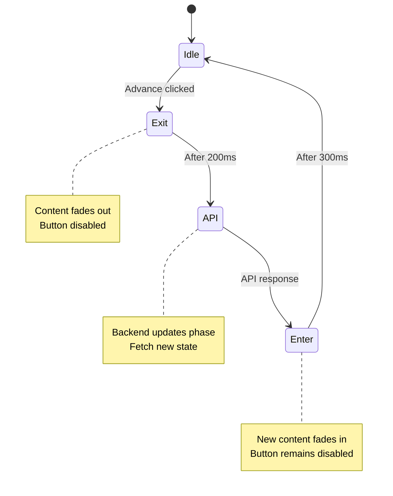
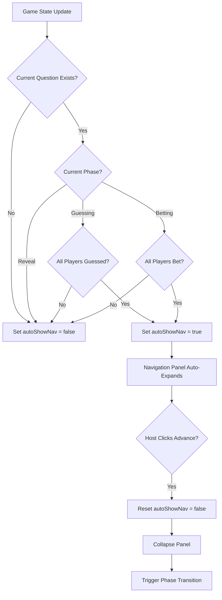
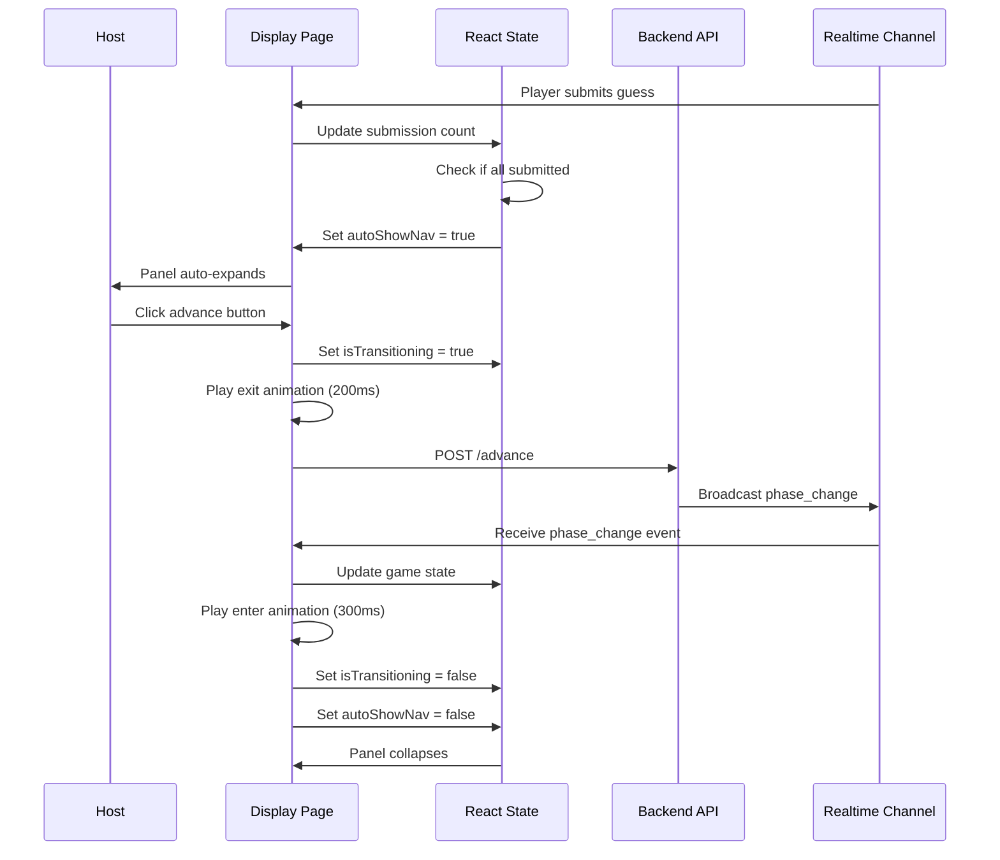

# Design Document: Display Page UX Improvements

## Overview

This design enhances the Trivia game display page with three key UX improvements:

1. **Auto-Show Advance Button**: Automatically reveals the navigation panel when all players complete their actions, reducing friction in game flow
2. **Phase Transition Animations**: Adds smooth visual transitions between game phases for a polished experience
3. **Compact Pre-Game Display**: Optimizes the join screen layout for smaller displays and projectors

The design leverages React state management, CSS transitions, and responsive design patterns to create a seamless host experience without requiring architectural changes to the existing codebase.

## Architecture

### Component Structure

The display page (`app/display/[gameId]/page.tsx`) will be enhanced with:

- **Auto-show logic**: React effect that monitors submission counts and controls navigation panel visibility
- **Animation system**: CSS-based transitions with JavaScript coordination for phase changes
- **Responsive pre-game layout**: Viewport-aware sizing using CSS custom properties and media queries

### State Management

New state variables to add to the DisplayViewPage component:

```typescript
const [isTransitioning, setIsTransitioning] = useState(false);
const [autoShowNav, setAutoShowNav] = useState(false);
const [previousPhase, setPreviousPhase] = useState<string | null>(null);
```

### Data Flow

1. **Submission Tracking**: Real-time updates via `useGameChannel` hook trigger state updates
2. **Auto-Show Detection**: React effect compares submission counts with total players
3. **Phase Transitions**: Advance button click triggers animation sequence before API call
4. **Animation Coordination**: CSS transitions controlled by React state changes

## Components and Interfaces

### Enhanced Navigation Panel

The existing navigation panel will be enhanced with auto-show capability:

```typescript
interface NavigationPanelProps {
  showNavigation: boolean;
  autoShowNav: boolean;
  isAdvancing: boolean;
  isTransitioning: boolean;
  currentPhase: string;
  onAdvance: () => void;
  onToggle: () => void;
}
```

**Behavior**:

- Auto-expands when `autoShowNav` is true
- Collapses automatically after advancing to next phase
- Remains manually toggleable regardless of auto-show state
- Visual indicator distinguishes auto-show from manual show

### Phase Transition System

**Animation Phases**:

1. **Exit**: Current content fades out (200ms)
2. **API Call**: Advance phase request to backend
3. **Enter**: New content fades in (300ms)

**Implementation approach**:

- CSS transitions for performance
- JavaScript coordination for timing
- Prevent interaction during transitions

```typescript
interface TransitionConfig {
  exitDuration: number; // 200ms
  enterDuration: number; // 300ms
  totalDuration: number; // 500ms
}
```

### Responsive Pre-Game Layout

**Size Constraints**:

- QR Code: max 200px × 200px (currently 256px)
- Join Code: max 6rem font size (currently 8rem)
- Heading: max 4rem font size (currently 6rem)
- Target viewport: 1920×1080 without scrolling

**Responsive Strategy**:

- Use `clamp()` for fluid typography
- Viewport height units (vh) for vertical spacing
- Media queries for extreme aspect ratios

## Data Models

### Auto-Show State

```typescript
interface AutoShowState {
  shouldShow: boolean; // Computed from submission counts
  isManuallyToggled: boolean; // User clicked toggle button
  lastAutoShowPhase: string | null; // Track which phase triggered auto-show
}
```

### Transition State

```typescript
interface TransitionState {
  isTransitioning: boolean;
  transitionPhase: "idle" | "exit" | "api" | "enter";
  fromPhase: string | null;
  toPhase: string | null;
}
```

### Submission Progress

```typescript
interface SubmissionProgress {
  submitted: number;
  total: number;
  isComplete: boolean;
  phase: "guessing" | "betting" | "reveal";
}
```

## Correctness Properties

_A property is a characteristic or behavior that should hold true across all valid executions of a system—essentially, a formal statement about what the system should do. Properties serve as the bridge between human-readable specifications and machine-verifiable correctness guarantees._

### Property 1: Auto-show on completion

_For any_ game state during guessing or betting phase, when the submission count equals the total player count, the navigation panel should automatically expand and become visible.

**Validates: Requirements 1.1, 1.2**

### Property 2: Advance button visibility during auto-show

_For any_ navigation panel state where auto-show is active, the advance button should be prominently displayed and accessible.

**Validates: Requirements 1.3**

### Property 3: Panel collapse after advance

_For any_ phase transition triggered by the advance button, the navigation panel should return to its collapsed state after the transition completes.

**Validates: Requirements 1.4**

### Property 4: Manual toggle independence

_For any_ auto-show state (active or inactive), the manual toggle button should always be able to change the navigation panel visibility state.

**Validates: Requirements 1.5**

### Property 5: Submission count display

_For any_ game state with active players during guessing or betting phase, the display should render a submission count in the format "X/Y [action]" where X is submitted count and Y is total players.

**Validates: Requirements 1.7**

### Property 6: Transition timing bounds

_For any_ phase transition animation, the total duration from start to completion should be between 300ms and 800ms.

**Validates: Requirements 2.4**

### Property 7: Button disabled during transition

_For any_ active transition animation, the advance button should be in a disabled state and not respond to click events.

**Validates: Requirements 2.6**

### Property 8: QR code size constraint

_For any_ pre-game display rendering, the QR code element should have dimensions no larger than 200px × 200px.

**Validates: Requirements 3.2**

### Property 9: Join code font size constraint

_For any_ pre-game display rendering, the join code text should have a computed font size no larger than 6rem.

**Validates: Requirements 3.3**

### Property 10: Heading font size constraint

_For any_ pre-game display rendering, the "Join Now!" heading should have a computed font size no larger than 4rem.

**Validates: Requirements 3.4**

### Property 11: Viewport fit constraint

_For any_ pre-game display rendering on a 1920×1080 viewport, the total content height should not exceed 1080px, ensuring no vertical scrolling is required.

**Validates: Requirements 3.5**

## Error Handling

### Auto-Show Logic Errors

**Scenario**: Submission count data is stale or incorrect

- **Handling**: Use defensive checks to ensure counts are non-negative and don't exceed total players
- **Fallback**: If data is invalid, default to manual-only navigation panel control

**Scenario**: Real-time connection drops during submission tracking

- **Handling**: Fallback polling mechanism (already implemented) ensures counts eventually update
- **User feedback**: Connection status indicator in header (already exists)

### Animation Errors

**Scenario**: CSS transition fails to complete

- **Handling**: Set maximum timeout (1000ms) to force transition completion
- **Recovery**: Reset transition state and allow user interaction

**Scenario**: User rapidly clicks advance button

- **Handling**: Disable button during transitions (Property 7)
- **Additional**: Debounce advance function to prevent race conditions

### Responsive Layout Errors

**Scenario**: Viewport is smaller than 1080p

- **Handling**: Use `clamp()` and media queries to scale content proportionally
- **Minimum**: Support down to 1280×720 (720p) with adjusted sizing

**Scenario**: QR code generation fails

- **Handling**: Display fallback text with join URL
- **User feedback**: Show error message in place of QR code

## Testing Strategy

### Unit Testing Approach

Unit tests will focus on specific examples and edge cases:

**Auto-Show Logic**:

- Test exact completion scenarios (all players submitted)
- Test edge case: zero players in game
- Test edge case: single player game
- Test manual toggle overrides auto-show
- Test panel state after phase advance

**Transition Coordination**:

- Test transition state machine (idle → exit → api → enter → idle)
- Test button disabled during each transition phase
- Test timeout recovery if transition hangs

**Responsive Sizing**:

- Test size calculations at 1920×1080 viewport
- Test size calculations at 1280×720 viewport
- Test font size clamping at various viewport widths

### Property-Based Testing Approach

Property tests will verify universal behaviors across randomized inputs using **fast-check** (JavaScript property-based testing library):

**Configuration**: Each property test will run a minimum of 100 iterations to ensure comprehensive coverage.

**Property 1: Auto-show on completion**

- **Generator**: Random game states with varying player counts (1-20) and submission counts (0-playerCount)
- **Test**: When submissions === players during guessing/betting, verify autoShowNav === true
- **Tag**: Feature: display-page-ux-improvements, Property 1: Auto-show on completion

**Property 2: Advance button visibility during auto-show**

- **Generator**: Random navigation panel states with autoShowNav boolean
- **Test**: When autoShowNav === true, verify button is rendered and visible
- **Tag**: Feature: display-page-ux-improvements, Property 2: Advance button visibility during auto-show

**Property 3: Panel collapse after advance**

- **Generator**: Random phase transitions (guessing→betting, betting→reveal, reveal→guessing)
- **Test**: After advance completes, verify showNavigation === false
- **Tag**: Feature: display-page-ux-improvements, Property 3: Panel collapse after advance

**Property 4: Manual toggle independence**

- **Generator**: Random auto-show states and manual toggle actions
- **Test**: Manual toggle always changes visibility regardless of auto-show state
- **Tag**: Feature: display-page-ux-improvements, Property 4: Manual toggle independence

**Property 5: Submission count display**

- **Generator**: Random game states with players (1-20) and submissions (0-playerCount)
- **Test**: Verify rendered text matches format "X/Y guessed" or "X/Y bet"
- **Tag**: Feature: display-page-ux-improvements, Property 5: Submission count display

**Property 6: Transition timing bounds**

- **Generator**: Random phase transitions
- **Test**: Measure actual transition duration, verify 300ms ≤ duration ≤ 800ms
- **Tag**: Feature: display-page-ux-improvements, Property 6: Transition timing bounds

**Property 7: Button disabled during transition**

- **Generator**: Random transition states (exit, api, enter phases)
- **Test**: Verify button disabled attribute is true during any transition phase
- **Tag**: Feature: display-page-ux-improvements, Property 7: Button disabled during transition

**Property 8: QR code size constraint**

- **Generator**: Random join codes (4-6 character strings)
- **Test**: Render pre-game display, measure QR code dimensions, verify ≤ 200px × 200px
- **Tag**: Feature: display-page-ux-improvements, Property 8: QR code size constraint

**Property 9: Join code font size constraint**

- **Generator**: Random join codes and viewport widths (1280-2560px)
- **Test**: Measure computed font size of join code, verify ≤ 6rem
- **Tag**: Feature: display-page-ux-improvements, Property 9: Join code font size constraint

**Property 10: Heading font size constraint**

- **Generator**: Random viewport widths (1280-2560px)
- **Test**: Measure computed font size of heading, verify ≤ 4rem
- **Tag**: Feature: display-page-ux-improvements, Property 10: Heading font size constraint

**Property 11: Viewport fit constraint**

- **Generator**: Random player counts (0-20) affecting content height
- **Test**: Render pre-game display at 1920×1080, measure total height, verify ≤ 1080px
- **Tag**: Feature: display-page-ux-improvements, Property 11: Viewport fit constraint

### Integration Testing

**End-to-End Scenarios**:

1. Complete game flow with auto-show: Start game → all players guess → panel auto-shows → advance → panel collapses
2. Manual override: Panel auto-shows → host manually closes → panel stays closed
3. Phase transitions: Verify smooth animations through complete game cycle
4. Pre-game display: Verify layout on various screen sizes

### Testing Tools

- **Unit Tests**: Jest + React Testing Library
- **Property Tests**: fast-check library (minimum 100 iterations per test)
- **Visual Regression**: Playwright for screenshot comparisons
- **Performance**: Chrome DevTools for animation frame rate monitoring

## Implementation Details

### Auto-Show Navigation Panel

**State Management**:

```typescript
// Add to DisplayViewPage component
const [autoShowNav, setAutoShowNav] = useState(false);

// Effect to compute auto-show state
useEffect(() => {
  if (!currentQuestion) {
    setAutoShowNav(false);
    return;
  }

  const isComplete =
    (gameState.game.currentPhase === "guessing" &&
      submittedGuesses === totalPlayers) ||
    (gameState.game.currentPhase === "betting" &&
      submittedBets === totalPlayers);

  setAutoShowNav(isComplete && totalPlayers > 0);
}, [
  currentQuestion,
  gameState.game.currentPhase,
  submittedGuesses,
  submittedBets,
  totalPlayers,
]);

// Reset auto-show after advancing
const advancePhase = async () => {
  // ... existing advance logic ...
  setAutoShowNav(false);
  setShowNavigation(false);
};
```

**Navigation Panel Rendering**:

```typescript
// Update navigation panel visibility logic
const isNavVisible = showNavigation || autoShowNav;

{isNavVisible && !showFinalResults && (
  <div className={`fixed bottom-20 right-4 bg-black bg-opacity-80 backdrop-blur-sm rounded-xl p-4 z-50 min-w-[200px] transition-all duration-300 ${
    autoShowNav ? 'ring-2 ring-green-400' : ''
  }`}>
    {autoShowNav && (
      <div className="text-xs text-green-400 mb-2">✓ All players ready</div>
    )}
    <div className="text-sm text-gray-400 mb-2">Navigation</div>
    <button
      onClick={advancePhase}
      disabled={isAdvancing || isTransitioning}
      className="w-full bg-tangerine-dream-500 hover:bg-tangerine-dream-600 disabled:bg-gray-600 text-white py-3 px-4 rounded-lg font-bold transition-colors"
    >
      {/* ... button text ... */}
    </button>
  </div>
)}
```

### Phase Transition Animations

**CSS Transitions**:

```css
/* Add to global styles or component styles */
.phase-content {
  transition:
    opacity 300ms ease-in-out,
    transform 300ms ease-in-out;
}

.phase-content-exit {
  opacity: 0;
  transform: translateY(-20px);
}

.phase-content-enter {
  opacity: 0;
  transform: translateY(20px);
}

.phase-content-active {
  opacity: 1;
  transform: translateY(0);
}
```

**JavaScript Coordination**:

```typescript
// Add transition state
const [isTransitioning, setIsTransitioning] = useState(false);
const [contentKey, setContentKey] = useState(0);

const advancePhaseWithAnimation = async () => {
  if (isTransitioning) return;

  setIsTransitioning(true);

  // Exit animation (200ms)
  await new Promise((resolve) => setTimeout(resolve, 200));

  // API call
  await advancePhase();

  // Force re-render with new content
  setContentKey((prev) => prev + 1);

  // Enter animation (300ms)
  await new Promise((resolve) => setTimeout(resolve, 300));

  setIsTransitioning(false);
};
```

**Transition State Machine**:



### Compact Pre-Game Layout

**Responsive Sizing**:

```typescript
// Replace pre-game section with responsive version
{!currentQuestion && (
  <div className="text-center py-8 px-4">
    {/* Heading - responsive size */}
    <div className="text-4xl md:text-5xl lg:text-6xl font-bold mb-6 md:mb-8"
         style={{ fontSize: 'clamp(2.5rem, 5vw, 4rem)' }}>
      Join Now!
    </div>

    {/* QR Code - constrained size */}
    {qrCodeUrl && (
      <div className="mb-6 md:mb-8 flex justify-center">
        
      </div>
    )}

    {/* Join Code - responsive size */}
    <div className="mb-6 md:mb-8">
      <div className="text-lg md:text-xl text-blue-200 mb-2 md:mb-3">
        Join Code:
      </div>
      <div className="font-bold font-mono bg-white text-blue-900 px-8 py-4 rounded-xl inline-block"
           style={{ fontSize: 'clamp(3rem, 8vw, 6rem)' }}>
        {gameState.game.joinCode}
      </div>
    </div>

    {/* Player Count - compact */}
    <div className="text-xl md:text-2xl text-blue-200 mb-6 md:mb-8">
      {gameState.players.length}{" "}
      {gameState.players.length === 1 ? "player" : "players"} ready
    </div>

    {/* Start Button - responsive */}
    <button
      onClick={advancePhase}
      disabled={isAdvancing || gameState.questions.length === 0}
      className="bg-tea-green-500 hover:bg-tea-green-600 disabled:bg-gray-600 text-white text-2xl md:text-3xl font-bold py-4 px-12 rounded-xl transition-colors disabled:cursor-not-allowed"
    >
      {isAdvancing ? "Starting..." : "Start Game"}
    </button>

    {gameState.questions.length === 0 && (
      <div className="text-lg md:text-xl text-yellow-300 mt-4">
        Add questions on the host page to start the game
      </div>
    )}
  </div>
)}
```

**Spacing Strategy**:

- Use `clamp()` for fluid typography: `clamp(min, preferred, max)`
- Reduce vertical margins: `mb-12` → `mb-6 md:mb-8`
- Constrain QR code: `max-w-[200px] max-h-[200px]`
- Scale padding proportionally: `py-20` → `py-8`

### Auto-Show Logic Flow



### Component Interaction Diagram



## Design Decisions and Rationale

### Decision 1: CSS Transitions vs JavaScript Animations

**Choice**: Use CSS transitions with JavaScript coordination

**Rationale**:

- CSS transitions are hardware-accelerated and more performant
- JavaScript only manages timing and state, not animation frames
- Simpler to maintain and debug
- Better browser compatibility

**Alternative considered**: React Spring or Framer Motion

- Rejected due to added bundle size and complexity for simple transitions

### Decision 2: Auto-Show vs Always-Visible Navigation

**Choice**: Auto-show navigation panel when ready

**Rationale**:

- Reduces visual clutter during gameplay
- Provides clear signal that game is ready to advance
- Maintains existing manual toggle for host control
- Balances automation with flexibility

**Alternative considered**: Always show advance button

- Rejected because it would clutter the display and reduce focus on game content

### Decision 3: Transition Duration (500ms total)

**Choice**: 200ms exit + 300ms enter = 500ms total

**Rationale**:

- Fast enough to feel responsive (< 1 second)
- Slow enough to be perceived as smooth
- Asymmetric timing (faster exit, slower enter) feels more natural
- Meets requirement of 300-800ms range

**Alternative considered**: Symmetric 250ms + 250ms

- Rejected because slower exit feels sluggish

### Decision 4: Responsive Sizing with clamp()

**Choice**: Use CSS `clamp()` for fluid typography

**Rationale**:

- Single declaration handles all viewport sizes
- No JavaScript required for size calculations
- Smooth scaling without breakpoint jumps
- Better browser support than container queries

**Alternative considered**: Multiple media query breakpoints

- Rejected due to maintenance overhead and stepped scaling

### Decision 5: Auto-Show Reset Timing

**Choice**: Reset auto-show immediately when advance is clicked

**Rationale**:

- Provides immediate feedback that action was registered
- Prevents confusion if transition takes time
- Ensures clean state for next phase
- Matches user expectation of button press

**Alternative considered**: Reset after transition completes

- Rejected because delayed feedback feels unresponsive

## Performance Considerations

### Animation Performance

- **Target**: 60fps (16.67ms per frame) during transitions
- **Optimization**: Use `transform` and `opacity` (GPU-accelerated properties)
- **Avoid**: Animating `height`, `width`, or `margin` (triggers layout reflow)

### State Update Frequency

- **Real-time updates**: Debounce rapid submission events (100ms)
- **Auto-show calculation**: Memoize with `useMemo` to prevent unnecessary recalculations
- **Transition state**: Use refs for timing to avoid render cycles

### Bundle Size Impact

- **No new dependencies**: All features use existing React and CSS
- **CSS additions**: ~50 lines of transition styles
- **JavaScript additions**: ~100 lines of state management logic
- **Total impact**: < 2KB gzipped

## Accessibility Considerations

### Keyboard Navigation

- Advance button remains keyboard accessible during auto-show
- Focus management during transitions (maintain focus on button)
- Escape key to manually close auto-shown panel

### Screen Readers

- Announce when navigation panel auto-shows: "All players ready. Advance button available."
- Announce phase transitions: "Transitioning to betting phase"
- ARIA live region for submission count updates

### Visual Indicators

- Auto-show state distinguished by green ring around panel
- Transition state shown by disabled button (visual + cursor change)
- High contrast maintained for all text on gradient backgrounds

## Browser Compatibility

### Minimum Requirements

- **CSS clamp()**: Chrome 79+, Firefox 75+, Safari 13.1+
- **CSS transitions**: All modern browsers
- **Backdrop filter**: Chrome 76+, Firefox 103+, Safari 9+

### Fallbacks

- **No clamp() support**: Use media queries with fixed sizes
- **No backdrop-filter**: Solid background color fallback
- **Reduced motion preference**: Respect `prefers-reduced-motion` media query

```css
@media (prefers-reduced-motion: reduce) {
  .phase-content {
    transition: none;
  }
}
```

## Security Considerations

### Input Validation

- Submission counts validated to be non-negative integers
- Total player count validated against database state
- Phase transitions validated server-side (already implemented)

### Rate Limiting

- Advance button debounced to prevent rapid-fire requests
- Transition state prevents double-submission
- Backend API already has rate limiting (existing implementation)

### XSS Prevention

- All user-generated content (player names, join codes) already sanitized
- No new user input fields introduced
- React's built-in XSS protection applies to all rendered content
