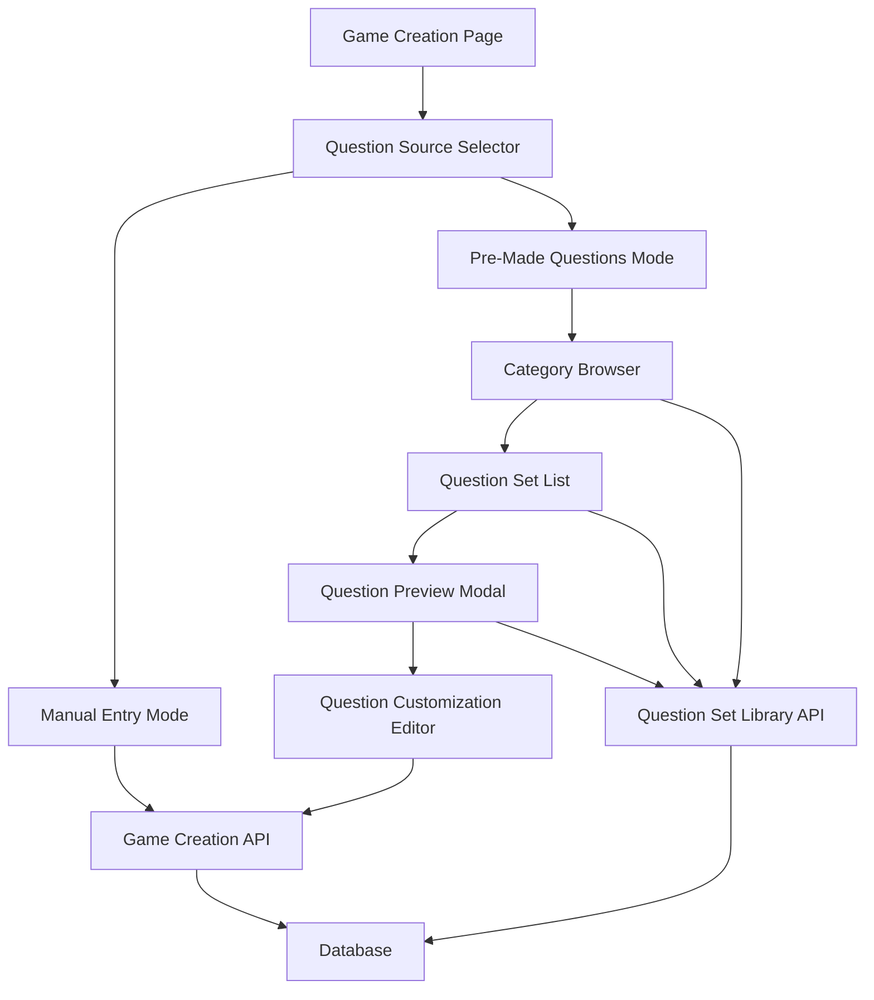

# Design Document: Pre-Made Question Sets

## Overview

This feature adds a question set library to the trivia game, enabling users to quickly create games using curated, pre-made question collections. The design introduces new database tables for storing question sets and categories, extends the game creation UI with a browsing and selection interface, and provides a preview and customization workflow before game creation.

The implementation maintains compatibility with the existing question data structure, ensuring pre-made questions integrate seamlessly with the current game engine. Users can browse categories, preview questions, select multiple sets, customize content, and combine pre-made questions with manually-created ones.

### Key Design Goals

1. **Quick Start Experience**: Reduce friction in game creation by providing ready-to-use question sets
2. **Flexibility**: Allow customization and combination of pre-made content with user-created questions
3. **Data Consistency**: Use identical data structures for pre-made and user-created questions
4. **Scalability**: Design the library system to support future expansion of categories and question sets

## Architecture

### System Components



### Data Flow

1. **Browsing Flow**: User selects pre-made mode → System fetches categories → User selects category → System fetches question sets → User previews sets
2. **Selection Flow**: User selects one or more sets → System loads questions into editor → User customizes questions → User creates game
3. **Storage Flow**: Question sets stored in dedicated tables → Selected questions copied to game-specific question table → Game engine processes all questions identically

### Component Responsibilities

- **QuestionSourceSelector**: Toggle between manual and pre-made question entry modes
- **CategoryBrowser**: Display available categories with question set counts
- **QuestionSetList**: Show question sets within a category with metadata
- **QuestionPreviewModal**: Display sample questions and allow full preview expansion
- **QuestionCustomizationEditor**: Reuse existing QuestionListEditor with pre-loaded questions
- **QuestionSetLibraryAPI**: Server-side endpoints for fetching categories and question sets

## Components and Interfaces

### Database Schema Extensions

#### Question Sets Table

```typescript
export const questionSets = pgTable("question_sets", {
  id: text("id").primaryKey(),
  categoryId: text("category_id")
    .notNull()
    .references(() => categories.id),
  name: text("name").notNull(),
  description: text("description"),
  questionCount: integer("question_count").notNull(),
  createdAt: timestamp("created_at").notNull().defaultNow(),
});
```

#### Categories Table

```typescript
export const categories = pgTable("categories", {
  id: text("id").primaryKey(),
  name: text("name").notNull().unique(),
  displayOrder: integer("display_order").notNull(),
  createdAt: timestamp("created_at").notNull().defaultNow(),
});
```

#### Question Set Questions Table

```typescript
export const questionSetQuestions = pgTable("question_set_questions", {
  id: text("id").primaryKey(),
  questionSetId: text("question_set_id")
    .notNull()
    .references(() => questionSets.id),
  orderIndex: integer("order_index").notNull(),
  text: text("text").notNull(),
  subText: text("sub_text"),
  correctAnswer: decimal("correct_answer", {
    precision: 20,
    scale: 2,
  }).notNull(),
  answerFormat: answerFormatEnum("answer_format").notNull().default("plain"),
  followUpNotes: text("follow_up_notes"),
});
```

### API Endpoints

#### GET /api/question-sets/categories

Returns all available categories with question set counts.

**Response:**

```typescript
{
  categories: Array<{
    id: string;
    name: string;
    displayOrder: number;
    questionSetCount: number;
  }>;
}
```

#### GET /api/question-sets?categoryId={categoryId}

Returns all question sets for a specific category.

**Response:**

```typescript
{
  questionSets: Array<{
    id: string;
    name: string;
    description: string | null;
    questionCount: number;
    categoryName: string;
  }>;
}
```

#### GET /api/question-sets/{setId}/questions

Returns all questions in a specific question set.

**Response:**

```typescript
{
  questions: Array<{
    id: string;
    text: string;
    subText: string | null;
    correctAnswer: string;
    answerFormat: "plain" | "currency" | "date" | "percentage";
    followUpNotes: string | null;
    orderIndex: number;
  }>;
}
```

### UI Components

#### QuestionSourceSelector Component

```typescript
interface QuestionSourceSelectorProps {
  selectedMode: "manual" | "premade";
  onModeChange: (mode: "manual" | "premade") => void;
  disabled?: boolean;
}
```

Displays two prominent options: "Create Questions Manually" and "Use Pre-Made Questions". Implemented as a radio button group or tab-style selector.

#### CategoryBrowser Component

```typescript
interface CategoryBrowserProps {
  onCategorySelect: (categoryId: string) => void;
  selectedCategoryId: string | null;
}
```

Displays category cards in a grid layout. Each card shows category name and number of available question sets.

#### QuestionSetList Component

```typescript
interface QuestionSetListProps {
  categoryId: string;
  selectedSetIds: string[];
  onSetSelect: (setId: string) => void;
  onSetDeselect: (setId: string) => void;
  onPreview: (setId: string) => void;
}
```

Displays question sets as selectable cards with checkboxes. Shows set name, description, and question count. Includes "Preview" button for each set.

#### QuestionPreviewModal Component

```typescript
interface QuestionPreviewModalProps {
  setId: string;
  onClose: () => void;
  onSelect: () => void;
}
```

Modal dialog showing:

- Question set name and description
- Total question count
- First 3 questions with full details (text, sub-text, answer, format)
- "Show All Questions" expandable section
- "Select This Set" and "Close" buttons

#### SelectedSetsPanel Component

```typescript
interface SelectedSetsPanelProps {
  selectedSets: Array<{
    id: string;
    name: string;
    categoryName: string;
    questionCount: number;
  }>;
  onRemoveSet: (setId: string) => void;
  onProceedToCustomization: () => void;
}
```

Sticky panel showing selected question sets with total question count. Allows removal of individual sets. Includes "Customize & Create Game" button.

## Data Models

### Category Model

```typescript
interface Category {
  id: string;
  name: string;
  displayOrder: number;
  createdAt: Date;
}
```

**Initial Categories:**

1. General Knowledge (displayOrder: 1)
2. Science (displayOrder: 2)
3. History (displayOrder: 3)
4. Pop Culture (displayOrder: 4)
5. Sports (displayOrder: 5)
6. Geography (displayOrder: 6)

### Question Set Model

```typescript
interface QuestionSet {
  id: string;
  categoryId: string;
  name: string;
  description: string | null;
  questionCount: number;
  createdAt: Date;
}
```

### Question Set Question Model

```typescript
interface QuestionSetQuestion {
  id: string;
  questionSetId: string;
  orderIndex: number;
  text: string;
  subText: string | null;
  correctAnswer: string; // Stored as decimal, displayed per answerFormat
  answerFormat: "plain" | "currency" | "date" | "percentage";
  followUpNotes: string | null;
}
```

**Note**: This structure is identical to the existing `questions` table except for the foreign key reference (questionSetId vs gameId).

### UI State Models

```typescript
interface GameCreationState {
  mode: "manual" | "premade";
  selectedCategoryId: string | null;
  selectedSetIds: string[];
  loadedQuestions: Array<{
    id: string; // Temporary ID for UI, will be replaced on save
    sourceSetId: string;
    sourceCategoryName: string;
    text: string;
    subText: string | null;
    correctAnswer: string;
    answerFormat: "plain" | "currency" | "date" | "percentage";
    followUpNotes: string | null;
    orderIndex: number;
  }>;
  isCustomizing: boolean;
}
```

## Correctness Properties

_A property is a characteristic or behavior that should hold true across all valid executions of a system—essentially, a formal statement about what the system should do. Properties serve as the bridge between human-readable specifications and machine-verifiable correctness guarantees._

### Property Reflection

After analyzing all acceptance criteria, I identified the following redundancies and consolidations:

- **Properties 3.3 and 4.1** both test that question counts are displayed accurately - these can be combined into a single property about count accuracy
- **Properties 5.3 and 6.4** both test question removal - 6.4 is more general (works for combined lists), so 5.3 is redundant
- **Properties 5.2** covers editing all fields - this is comprehensive and doesn't need separate properties per field
- **Properties 7.1 and 1.2** both verify data structure consistency - these can be combined into one property about format consistency
- **Properties 7.2 and 7.3** both verify that pre-made and manual questions are processed identically - 7.3 is more comprehensive

### Property 1: Question Set Data Format Consistency

_For any_ question set question in the library, it should have the same data structure as user-created questions (text, subText, correctAnswer, answerFormat, followUpNotes fields).

**Validates: Requirements 1.2, 7.1**

### Property 2: Question Set Retrieval Completeness

_For any_ question set ID, retrieving the question set should return all questions in that set with all metadata fields populated (no null required fields).

**Validates: Requirements 1.4**

### Property 3: Mode Switching Preserves State

_For any_ game creation state, switching from manual to pre-made mode and back should preserve any manually entered questions.

**Validates: Requirements 2.3**

### Property 4: Category Display Completeness

_For any_ set of categories in the Question_Set_Library, the Game_Creator should display all categories when in pre-made mode.

**Validates: Requirements 3.1**

### Property 5: Category Filtering Accuracy

_For any_ selected category, the displayed question sets should include all and only the question sets belonging to that category.

**Validates: Requirements 3.2**

### Property 6: Question Count Display Accuracy

_For any_ question set, the displayed question count should equal the actual number of questions in that set.

**Validates: Requirements 3.3, 4.1**

### Property 7: Multi-Selection State Management

_For any_ sequence of question set selections and deselections, the selection state should accurately reflect which sets are currently selected.

**Validates: Requirements 3.4, 6.1**

### Property 8: Preview Content Completeness

_For any_ question set with at least 3 questions, the preview should display at least 3 questions with their text, correct answer, and answer format.

**Validates: Requirements 4.2, 4.4**

### Property 9: Preview Expansion Shows All Questions

_For any_ question set, expanding the preview should display all questions in the set.

**Validates: Requirements 4.3**

### Property 10: Question Set Loading Completeness

_For any_ selected question set, loading it into the editor should create editable entries for all questions in the set.

**Validates: Requirements 5.1**

### Property 11: Question Field Editing

_For any_ question in the editor and any valid field value, editing that field should update the question's data with the new value.

**Validates: Requirements 5.2**

### Property 12: Question Removal Decreases List Size

_For any_ question list with N questions, removing a question should result in a list with N-1 questions.

**Validates: Requirements 5.3, 6.4**

### Property 13: Question Reordering Updates Indices

_For any_ two questions in the editor, swapping their positions should swap their orderIndex values.

**Validates: Requirements 5.4**

### Property 14: Manual Question Addition Increases List Size

_For any_ question list with N questions, adding a new manually-created question should result in a list with N+1 questions.

**Validates: Requirements 5.5**

### Property 15: Multiple Set Combination Completeness

_For any_ collection of selected question sets, the combined question list should contain all questions from all selected sets.

**Validates: Requirements 6.2**

### Property 16: Source Category Metadata Preservation

_For any_ question in a combined list, the displayed source category should match the category of the question set it originated from.

**Validates: Requirements 6.3**

### Property 17: Pre-Made and Manual Question Processing Equivalence

_For any_ question regardless of source (pre-made or manual), the game engine should process it identically during gameplay (same validation, scoring, display logic).

**Validates: Requirements 7.2, 7.3**

### Property 18: Game Creation with Valid Questions

_For any_ non-empty list of valid questions, creating a game should succeed and the created game should contain all questions.

**Validates: Requirements 8.1, 8.3**

### Property 19: Game Creation Navigation

_For any_ successfully created game, the user should be navigated to the host page for that game.

**Validates: Requirements 8.4**

## Error Handling

### Validation Errors

**Empty Question List Validation**

- **Trigger**: User attempts to create game with zero questions
- **Response**: Display error message "At least one question is required to create a game"
- **Recovery**: Keep user on creation page with current state preserved
- **Validates: Requirements 8.2**

**Invalid Question Data**

- **Trigger**: Question missing required fields (text or correctAnswer)
- **Response**: Highlight invalid question with specific error message
- **Recovery**: Prevent game creation until all questions are valid

**Network Errors During Category/Set Loading**

- **Trigger**: API request fails when fetching categories or question sets
- **Response**: Display error banner with retry button
- **Recovery**: Allow user to retry request or switch to manual mode

### Data Integrity Errors

**Question Set Not Found**

- **Trigger**: User attempts to load a question set that no longer exists
- **Response**: Display error message and remove set from selection
- **Recovery**: Allow user to continue with other selected sets

**Category Not Found**

- **Trigger**: User attempts to view question sets for a deleted category
- **Response**: Display error message and return to category browser
- **Recovery**: Refresh category list to show current categories

### Concurrent Modification Handling

**Question Set Modified During Selection**

- **Trigger**: Question set is updated while user is previewing/selecting
- **Response**: Load the current version of questions when user proceeds to customization
- **Recovery**: No action needed - user works with latest data

**Game Creation Conflict**

- **Trigger**: Database error during game creation (e.g., ID collision)
- **Response**: Display error message with retry option
- **Recovery**: Regenerate game ID and retry creation

## Testing Strategy

### Dual Testing Approach

This feature requires both unit tests and property-based tests for comprehensive coverage:

- **Unit tests**: Verify specific UI interactions, edge cases (empty lists, single question sets), and error conditions
- **Property tests**: Verify universal properties across all inputs (data consistency, completeness, state management)

### Property-Based Testing Configuration

**Library Selection**: Use `fast-check` for TypeScript/JavaScript property-based testing

**Test Configuration**:

- Minimum 100 iterations per property test
- Each test tagged with format: `Feature: pre-made-question-sets, Property {number}: {property_text}`
- Custom generators for: categories, question sets, questions, UI state

**Example Generators**:

```typescript
// Generator for question set questions
const questionSetQuestionArb = fc.record({
  id: fc.uuid(),
  questionSetId: fc.uuid(),
  orderIndex: fc.nat(),
  text: fc.string({ minLength: 1, maxLength: 200 }),
  subText: fc.option(fc.string({ maxLength: 200 })),
  correctAnswer: fc
    .double({ min: -999999, max: 999999 })
    .map((n) => n.toFixed(2)),
  answerFormat: fc.constantFrom("plain", "currency", "date", "percentage"),
  followUpNotes: fc.option(fc.string({ maxLength: 500 })),
});

// Generator for question sets
const questionSetArb = fc.record({
  id: fc.uuid(),
  categoryId: fc.uuid(),
  name: fc.string({ minLength: 1, maxLength: 100 }),
  description: fc.option(fc.string({ maxLength: 300 })),
  questionCount: fc.nat({ max: 50 }),
});

// Generator for categories
const categoryArb = fc.record({
  id: fc.uuid(),
  name: fc.string({ minLength: 1, maxLength: 50 }),
  displayOrder: fc.nat({ max: 100 }),
});
```

### Unit Testing Focus Areas

**UI Component Tests**:

- QuestionSourceSelector mode switching
- CategoryBrowser category selection
- QuestionSetList multi-selection with checkboxes
- QuestionPreviewModal expansion/collapse
- SelectedSetsPanel set removal

**Edge Cases**:

- Empty category (no question sets)
- Question set with exactly 1 or 2 questions (preview behavior)
- Selecting all question sets in a category
- Removing all questions from combined list
- Creating game with exactly 1 question

**Integration Tests**:

- Complete flow: browse → select → preview → customize → create
- Switching between manual and pre-made modes mid-creation
- Combining pre-made questions with manually added questions
- API error handling and retry logic

**Error Condition Tests**:

- Attempt to create game with zero questions
- Network failure during category fetch
- Question set deleted between preview and selection
- Invalid question data in customization editor

### Test Data Requirements

**Seed Data for Development/Testing**:

- 6 categories (as specified in requirements)
- Minimum 3 question sets per category
- Minimum 5 questions per question set
- Mix of answer formats across questions
- Some questions with subText and followUpNotes, some without

**Property Test Data**:

- Generated categories: 1-20 categories
- Generated question sets: 0-10 sets per category
- Generated questions: 1-50 questions per set
- All valid combinations of optional fields (subText, followUpNotes)

### Coverage Goals

- **Line Coverage**: Minimum 80% for new code
- **Branch Coverage**: Minimum 75% for conditional logic
- **Property Coverage**: 100% of correctness properties implemented as tests
- **Integration Coverage**: All user flows from requirements tested end-to-end
