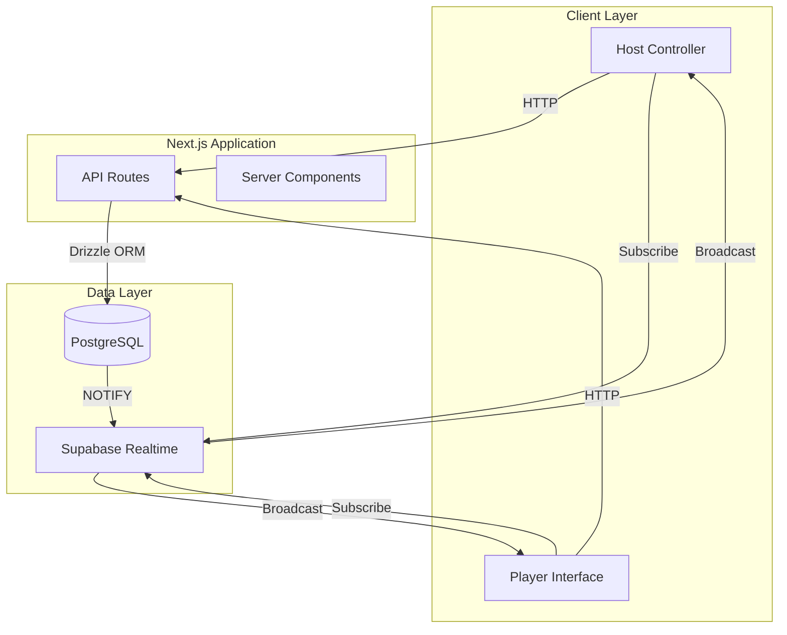
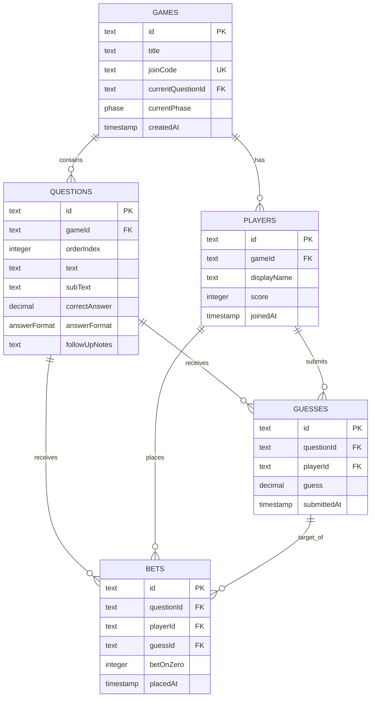

# Design Document: Wits and Wagers Game Show

## Overview

This design document specifies the technical architecture for a real-time multiplayer trivia game application based on Wits and Wagers. The system consists of two primary interfaces: a presenter view for the game host to control game flow, and a player view for participants to submit guesses and place bets.

The application follows a client-server architecture with real-time synchronization using Supabase Realtime. The game host creates sessions with numerical trivia questions, players join via QR code or join code, and gameplay progresses through three phases per question: guessing, betting, and reveal. Points are awarded to players who submit the closest guess and to those who bet on the closest guess.

### Key Design Decisions

1. **Real-time Architecture**: Using Supabase Realtime (PostgreSQL LISTEN/NOTIFY) for state synchronization instead of polling or WebSockets to leverage existing infrastructure
2. **Stateless Client**: Player and host interfaces derive their state from the database, making reconnection seamless
3. **Phase-based State Machine**: Game progression is modeled as a finite state machine with explicit phase transitions
4. **Optimistic UI Updates**: Client interfaces update immediately on user actions while database writes happen asynchronously
5. **No Authentication**: Initial version uses join codes and display names without user accounts

## Architecture

### System Components



### Component Responsibilities

**Host Controller**

- Create game sessions with questions
- Display QR code for player joining
- Control phase transitions (guessing → betting → reveal → next question)
- Monitor player participation counts
- View current game state

**Player Interface**

- Join game session via QR code or join code
- Submit numerical guesses during guessing phase
- Place bets on guesses during betting phase
- View correct answer and scores during reveal phase
- Display personal point total

**API Routes**

- `POST /api/games` - Create new game session
- `POST /api/games/[code]/join` - Join game session
- `POST /api/games/[gameId]/guesses` - Submit guess
- `POST /api/games/[gameId]/bets` - Place bet
- `POST /api/games/[gameId]/advance` - Advance phase (host only)
- `GET /api/games/[gameId]/state` - Get current game state

**Supabase Realtime**

- Subscribe to game session changes
- Broadcast phase transitions
- Notify clients of new players, guesses, and bets
- Propagate score updates

### Data Flow

**Game Creation Flow**

1. Host submits game creation form with questions
2. API route generates unique 6-character join code
3. Database stores game session and questions
4. API returns game ID and join code
5. Host interface displays QR code with join URL

**Player Join Flow**

1. Player scans QR code or enters join code
2. Player submits display name
3. API validates name and adds player to session
4. Database stores player record
5. Realtime notifies host of new player
6. Player interface subscribes to game updates

**Question Phase Flow**

1. Host clicks "Start Question" or "Next Phase"
2. API updates game state in database
3. Database trigger fires NOTIFY event
4. Realtime broadcasts phase change to all clients
5. Player interfaces update to show appropriate UI
6. Players submit guesses/bets
7. API persists submissions to database

**Scoring Flow**

1. Host advances to reveal phase
2. API calculates closest guess (minimum absolute difference)
3. API awards points: 1 to closest guesser, 1 to each correct bettor
4. Database updates player scores
5. Realtime broadcasts score updates
6. Player interfaces display updated scores

## Components and Interfaces

### Frontend Components

**Host Dashboard** (`/host/[gameId]`)

- Game session header with join code and QR code
- Question list with current question highlighted
- Phase control buttons (Next Phase, Previous Question, Next Question)
- Player count and submission status
- Current question display with answer (hidden until reveal)

**Player View** (`/play/[gameId]`)

- Game session header with player name and score
- Question display (size varies by phase)
- Phase-specific input:
  - Guessing: Numerical input field with submit button
  - Betting: Grid of guess cards (including zero)
  - Reveal: Correct answer, closest guess highlighted, follow-up notes
- Waiting state when submission complete

**Game Creation Form** (`/host/create`)

- Game title input
- Dynamic question list with add/remove
- Per-question fields:
  - Question text (required)
  - Sub-text (optional)
  - Correct answer (required, numerical)
  - Answer format (dropdown: plain, currency, date, percentage)
  - Follow-up notes (optional)
- Create game button

**Join Page** (`/join/[code]`)

- Display name input (1-30 characters)
- Join button
- Error display for invalid codes

### API Interfaces

```typescript
// POST /api/games
interface CreateGameRequest {
  title: string;
  questions: {
    text: string;
    subText?: string;
    correctAnswer: number;
    answerFormat: "plain" | "currency" | "date" | "percentage";
    followUpNotes?: string;
  }[];
}

interface CreateGameResponse {
  gameId: string;
  joinCode: string;
  joinUrl: string;
}

// POST /api/games/[code]/join
interface JoinGameRequest {
  displayName: string;
}

interface JoinGameResponse {
  playerId: string;
  gameId: string;
}

// POST /api/games/[gameId]/guesses
interface SubmitGuessRequest {
  playerId: string;
  questionId: string;
  guess: number;
}

interface SubmitGuessResponse {
  guessId: string;
}

// POST /api/games/[gameId]/bets
interface PlaceBetRequest {
  playerId: string;
  questionId: string;
  guessId: string; // Can be a guess ID or "zero"
}

interface PlaceBetResponse {
  betId: string;
}

// POST /api/games/[gameId]/advance
interface AdvancePhaseRequest {
  questionId: string;
  targetPhase: "guessing" | "betting" | "reveal";
}

interface AdvancePhaseResponse {
  currentPhase: string;
  scores?: Record<string, number>; // Included when advancing to reveal
}

// GET /api/games/[gameId]/state
interface GameStateResponse {
  game: {
    id: string;
    title: string;
    joinCode: string;
    currentQuestionId: string;
    currentPhase: "guessing" | "betting" | "reveal";
  };
  questions: Question[];
  players: Player[];
  guesses: Guess[];
  bets: Bet[];
  scores: Record<string, number>;
}
```

### Realtime Event Interfaces

```typescript
// Supabase Realtime channel: `game:{gameId}`

interface PhaseChangeEvent {
  type: "phase_change";
  questionId: string;
  phase: "guessing" | "betting" | "reveal";
  timestamp: string;
}

interface PlayerJoinedEvent {
  type: "player_joined";
  player: {
    id: string;
    displayName: string;
  };
  timestamp: string;
}

interface GuessSubmittedEvent {
  type: "guess_submitted";
  questionId: string;
  guessCount: number;
  timestamp: string;
}

interface BetPlacedEvent {
  type: "bet_placed";
  questionId: string;
  betCount: number;
  timestamp: string;
}

interface ScoreUpdateEvent {
  type: "score_update";
  scores: Record<string, number>;
  closestGuessId: string;
  timestamp: string;
}
```

## Data Models

### Database Schema

```typescript
// Drizzle ORM schema definitions

import {
  pgTable,
  text,
  integer,
  timestamp,
  decimal,
  pgEnum,
} from "drizzle-orm/pg-core";

export const answerFormatEnum = pgEnum("answer_format", [
  "plain",
  "currency",
  "date",
  "percentage",
]);
export const phaseEnum = pgEnum("phase", ["guessing", "betting", "reveal"]);

export const games = pgTable("games", {
  id: text("id").primaryKey(),
  title: text("title").notNull(),
  joinCode: text("join_code").notNull().unique(),
  currentQuestionId: text("current_question_id"),
  currentPhase: phaseEnum("current_phase").notNull().default("guessing"),
  createdAt: timestamp("created_at").notNull().defaultNow(),
});

export const questions = pgTable("questions", {
  id: text("id").primaryKey(),
  gameId: text("game_id")
    .notNull()
    .references(() => games.id),
  orderIndex: integer("order_index").notNull(),
  text: text("text").notNull(),
  subText: text("sub_text"),
  correctAnswer: decimal("correct_answer", {
    precision: 20,
    scale: 2,
  }).notNull(),
  answerFormat: answerFormatEnum("answer_format").notNull().default("plain"),
  followUpNotes: text("follow_up_notes"),
});

export const players = pgTable("players", {
  id: text("id").primaryKey(),
  gameId: text("game_id")
    .notNull()
    .references(() => games.id),
  displayName: text("display_name").notNull(),
  score: integer("score").notNull().default(0),
  joinedAt: timestamp("joined_at").notNull().defaultNow(),
});

export const guesses = pgTable("guesses", {
  id: text("id").primaryKey(),
  questionId: text("question_id")
    .notNull()
    .references(() => questions.id),
  playerId: text("player_id")
    .notNull()
    .references(() => players.id),
  guess: decimal("guess", { precision: 20, scale: 2 }).notNull(),
  submittedAt: timestamp("submitted_at").notNull().defaultNow(),
});

export const bets = pgTable("bets", {
  id: text("id").primaryKey(),
  questionId: text("question_id")
    .notNull()
    .references(() => questions.id),
  playerId: text("player_id")
    .notNull()
    .references(() => players.id),
  guessId: text("guess_id"), // Null if betting on zero
  betOnZero: integer("bet_on_zero").notNull().default(0), // 1 if betting on zero, 0 otherwise
  placedAt: timestamp("placed_at").notNull().defaultNow(),
});
```

### Entity Relationships



### Data Constraints

1. **Join Code Uniqueness**: Each game must have a unique 6-character alphanumeric join code
2. **Display Name Length**: Player display names must be 1-30 characters
3. **One Guess Per Player Per Question**: Each player can submit at most one guess per question
4. **One Bet Per Player Per Question**: Each player can place at most one bet per question
5. **Question Order**: Questions within a game must have unique, sequential order indices starting from 0
6. **Phase Progression**: Phases must progress in order: guessing → betting → reveal → (next question) guessing
7. **Score Non-Negative**: Player scores cannot be negative (initialized to 0)

## Correctness Properties

A property is a characteristic or behavior that should hold true across all valid executions of a system—essentially, a formal statement about what the system should do. Properties serve as the bridge between human-readable specifications and machine-verifiable correctness guarantees.

### Property 1: Required Field Validation

For any game creation request, if question text or correct answer is missing from any question, the system should reject the request and return a validation error.

**Validates: Requirements 1.3**

### Property 2: Optional Field Acceptance

For any game creation request with valid required fields, the system should accept the request regardless of whether optional fields (subText, followUpNotes) are provided or omitted.

**Validates: Requirements 1.4**

### Property 3: Answer Format Type Support

For any game creation request, all answer format types (plain, currency, date, percentage) should be accepted as valid values.

**Validates: Requirements 1.5, 9.1**

### Property 4: Join Code Uniqueness

For any two game sessions created by the system, their join codes should be different.

**Validates: Requirements 1.6**

### Property 5: Game Creation Round Trip

For any valid game creation request with questions, creating the game and then retrieving it from the database should return a game with all questions matching the original request data (title, question text, sub-text, correct answer, answer format, follow-up notes).

**Validates: Requirements 1.7, 10.2**

### Property 6: QR Code Encoding

For any game session, the generated QR code should decode to a URL containing the correct join code for that game.

**Validates: Requirements 2.1**

### Property 7: Display Name Length Validation

For any display name, the system should accept names with length between 1 and 30 characters (inclusive) and reject names with length 0 or greater than 30 characters.

**Validates: Requirements 2.4**

### Property 8: Player Join Round Trip

For any valid player join request, joining a game and then retrieving the player list should include a player with the submitted display name.

**Validates: Requirements 2.5, 2.7, 10.3**

### Property 9: Player ID Uniqueness

For any game session with multiple players, all player IDs within that session should be unique.

**Validates: Requirements 2.6**

### Property 10: Guess Numerical Validation

For any guess submission, the system should accept valid numerical values (integers, decimals, negative numbers) and reject non-numerical inputs.

**Validates: Requirements 3.4**

### Property 11: Guess Submission Round Trip

For any valid guess submission, submitting a guess and then retrieving guesses for that question should include a guess with the submitted value, associated with the correct player ID and question ID.

**Validates: Requirements 3.5, 3.6, 10.4**

### Property 12: Guess Ordering

For any set of guesses for a question, retrieving the guesses for betting should return them in ascending numerical order.

**Validates: Requirements 4.1**

### Property 13: Zero Betting Option

For any question in the betting phase, the available betting options should always include zero, regardless of whether any player submitted a guess of zero.

**Validates: Requirements 4.2**

### Property 14: Bet Placement Round Trip

For any valid bet placement, placing a bet and then retrieving bets for that question should include a bet associated with the correct player ID, question ID, and guess ID (or zero flag).

**Validates: Requirements 4.5, 4.8, 10.5**

### Property 15: Self-Betting Permission

For any player who has submitted a guess for a question, the system should allow that player to place a bet on their own guess.

**Validates: Requirements 4.6**

### Property 16: Closest Guess Calculation

For any set of guesses and a correct answer, the identified closest guess should be the guess with the minimum absolute difference from the correct answer.

**Validates: Requirements 5.2**

### Property 17: Scoring Correctness

For any question with guesses and bets, when advancing to the reveal phase, the player who submitted the closest guess should have their score increased by 1, and each player who bet on the closest guess should have their score increased by 1.

**Validates: Requirements 5.5, 5.6**

### Property 18: Tie-Breaking Rule

For any question where two or more guesses have equal absolute distance from the correct answer, the system should select the numerically lower guess as the closest guess.

**Validates: Requirements 5.7**

### Property 19: Score Update Round Trip

For any score changes during reveal phase, the updated scores should persist to the database such that retrieving player data returns the updated score values.

**Validates: Requirements 5.8, 10.6**

### Property 20: Initial Score Value

For any newly joined player, their initial score should be zero.

**Validates: Requirements 6.3**

### Property 21: Score Retrieval Consistency

For any player in a game, retrieving the player's current score from the database should return the same value as the player's stored score field.

**Validates: Requirements 6.4**

### Property 22: Phase Transition State Machine

For any game session, phase transitions should follow the valid state machine: guessing → betting → reveal → (next question) guessing. Advancing the phase should update the current phase in the database to the next valid state.

**Validates: Requirements 7.3, 7.4, 7.5**

### Property 23: Reconnection State Preservation

For any player in a game, if the player's connection is interrupted and then re-established, retrieving the game state should return the player's current score, submitted guesses, and placed bets unchanged.

**Validates: Requirements 8.5**

### Property 24: Number Formatting

For any numerical value and format type, applying the format should produce:

- Currency: "$" prefix and two decimal places (e.g., "$123.45")
- Date: four-digit year (e.g., "2024")
- Percentage: "%" suffix (e.g., "75%")
- Plain: unmodified number string (e.g., "123.45")

**Validates: Requirements 9.2, 9.3, 9.4, 9.5, 9.6, 9.7**

### Property 25: Database Error Handling

For any database write operation that fails, the system should catch the error, log it, and return an error response to the client rather than crashing.

**Validates: Requirements 10.7**

## Error Handling

### Error Categories

**Validation Errors**

- Invalid display name length (< 1 or > 30 characters)
- Missing required fields (question text, correct answer)
- Invalid numerical input for guesses
- Invalid format type enum value

**State Errors**

- Attempting to join a non-existent game
- Submitting a guess when not in guessing phase
- Placing a bet when not in betting phase
- Advancing phase in invalid order
- Submitting multiple guesses for the same question
- Placing multiple bets for the same question

**Database Errors**

- Connection failures
- Write operation failures
- Constraint violations (unique join code, foreign key references)
- Transaction rollback failures

**Network Errors**

- Realtime connection drops
- API request timeouts
- Failed reconnection attempts

### Error Handling Strategies

**Client-Side Validation**

- Validate display name length before submission
- Validate numerical input format before submitting guesses
- Disable submission buttons when not in appropriate phase
- Show inline validation errors on form fields

**API Error Responses**

```typescript
interface ErrorResponse {
  error: {
    code: string;
    message: string;
    details?: Record<string, any>;
  };
}

// Error codes
const ERROR_CODES = {
  VALIDATION_ERROR: "VALIDATION_ERROR",
  GAME_NOT_FOUND: "GAME_NOT_FOUND",
  INVALID_PHASE: "INVALID_PHASE",
  DUPLICATE_SUBMISSION: "DUPLICATE_SUBMISSION",
  DATABASE_ERROR: "DATABASE_ERROR",
  NETWORK_ERROR: "NETWORK_ERROR",
};
```

**Database Transaction Handling**

- Wrap multi-step operations (game creation, scoring) in transactions
- Rollback on any failure within transaction
- Log transaction failures with full context
- Return user-friendly error messages

**Realtime Connection Resilience**

- Implement exponential backoff for reconnection attempts
- Maximum 5 reconnection attempts before showing error
- Fetch current game state on successful reconnection
- Show connection status indicator to users

**Graceful Degradation**

- If Realtime fails, fall back to polling every 3 seconds
- Cache last known game state on client
- Show "connection lost" banner when disconnected
- Allow offline viewing of current state (no submissions)

## Testing Strategy

### Testing Approach

This application requires both unit testing and property-based testing to ensure correctness. Unit tests verify specific examples and edge cases, while property tests verify universal behaviors across all possible inputs.

### Property-Based Testing

**Framework**: fast-check (JavaScript/TypeScript property-based testing library)

**Configuration**:

- Minimum 100 iterations per property test
- Each test tagged with format: `Feature: wits-wagers-game-show, Property {number}: {property_text}`
- Seed-based reproducibility for failed test cases
- Shrinking enabled to find minimal failing examples

**Property Test Coverage**:

Each of the 25 correctness properties defined above must be implemented as a property-based test. Property tests should:

- Generate random valid inputs using fast-check arbitraries
- Execute the system behavior
- Assert the property holds for all generated inputs
- Reference the design document property in test comments

Example property test structure:

```typescript
import fc from "fast-check";

// Feature: wits-wagers-game-show, Property 5: Game Creation Round Trip
test("game creation round trip preserves all data", async () => {
  await fc.assert(
    fc.asyncProperty(gameCreationRequestArbitrary(), async (request) => {
      const { gameId } = await createGame(request);
      const retrieved = await getGame(gameId);

      expect(retrieved.title).toBe(request.title);
      expect(retrieved.questions).toHaveLength(request.questions.length);

      request.questions.forEach((q, i) => {
        expect(retrieved.questions[i].text).toBe(q.text);
        expect(retrieved.questions[i].correctAnswer).toBe(q.correctAnswer);
        // ... verify all fields
      });
    }),
    { numRuns: 100 },
  );
});
```

**Arbitraries to Implement**:

- `gameCreationRequestArbitrary()` - Valid game creation requests
- `displayNameArbitrary()` - Valid display names (1-30 chars)
- `numericalGuessArbitrary()` - Valid numerical guesses
- `questionWithGuessesArbitrary()` - Questions with random guesses
- `formatTypeArbitrary()` - Answer format enum values

### Unit Testing

**Framework**: Vitest (for Next.js/TypeScript)

**Unit Test Focus**:

- API route handlers (create game, join, submit guess, place bet, advance phase)
- Scoring calculation logic with specific examples
- Format function with specific values
- QR code generation and decoding
- Database query functions
- Realtime event handlers

**Example Unit Tests**:

```typescript
describe("scoring calculation", () => {
  test("awards point to closest guesser", () => {
    const guesses = [
      { playerId: "p1", guess: 100 },
      { playerId: "p2", guess: 150 },
    ];
    const correctAnswer = 120;

    const result = calculateScoring(guesses, [], correctAnswer);

    expect(result.closestGuessId).toBe(guesses[0].id);
    expect(result.scoreChanges["p1"]).toBe(1);
  });

  test("tie-breaking selects lower guess", () => {
    const guesses = [
      { playerId: "p1", guess: 100 },
      { playerId: "p2", guess: 140 },
    ];
    const correctAnswer = 120; // Both 20 away

    const result = calculateScoring(guesses, [], correctAnswer);

    expect(result.closestGuessId).toBe(guesses[0].id); // Lower guess
  });
});

describe("format function", () => {
  test("formats currency with dollar sign and decimals", () => {
    expect(formatNumber(1234.5, "currency")).toBe("$1234.50");
  });

  test("formats date as year", () => {
    expect(formatNumber(2024, "date")).toBe("2024");
  });

  test("formats percentage with percent sign", () => {
    expect(formatNumber(75, "percentage")).toBe("75%");
  });
});
```

**Edge Cases to Test**:

- Empty guess list (only zero available for betting)
- Single player game
- All players bet on zero
- Guess exactly equals correct answer
- Very large numbers (> 1 million)
- Negative numbers
- Decimal precision edge cases

### Integration Testing

**Scope**: End-to-end flows through API routes and database

**Key Flows to Test**:

1. Complete game flow: create → join → guess → bet → reveal → next question
2. Multiple players joining simultaneously
3. Phase transitions with partial submissions
4. Reconnection after disconnect
5. Database transaction rollback on error

**Tools**:

- Vitest for test execution
- Testcontainers for PostgreSQL test database
- Supertest for API route testing

### Manual Testing Checklist

**Real-time Synchronization**:

- [ ] Open host and player views in separate browsers
- [ ] Verify phase changes appear on player view within 2 seconds
- [ ] Verify new player appears on host view within 2 seconds
- [ ] Verify guess count updates on host view as players submit

**QR Code Flow**:

- [ ] Generate QR code on host view
- [ ] Scan with mobile device
- [ ] Verify correct join page loads
- [ ] Complete join flow on mobile

**Multi-Device Testing**:

- [ ] Test on desktop Chrome, Firefox, Safari
- [ ] Test on mobile iOS Safari, Android Chrome
- [ ] Verify responsive layout on all screen sizes

**Error Scenarios**:

- [ ] Disconnect network during guessing phase
- [ ] Reconnect and verify state restored
- [ ] Submit invalid display name
- [ ] Submit non-numerical guess
- [ ] Attempt to guess during betting phase

### Performance Testing

**Load Scenarios**:

- 10 players in single game (typical)
- 50 players in single game (stress test)
- 10 concurrent games with 10 players each

**Metrics to Monitor**:

- API response time (target: < 200ms p95)
- Realtime event propagation delay (target: < 2 seconds)
- Database query time (target: < 50ms p95)
- Memory usage on client and server

**Tools**:

- k6 for load testing
- PostgreSQL EXPLAIN ANALYZE for query optimization
- Chrome DevTools for client performance profiling
